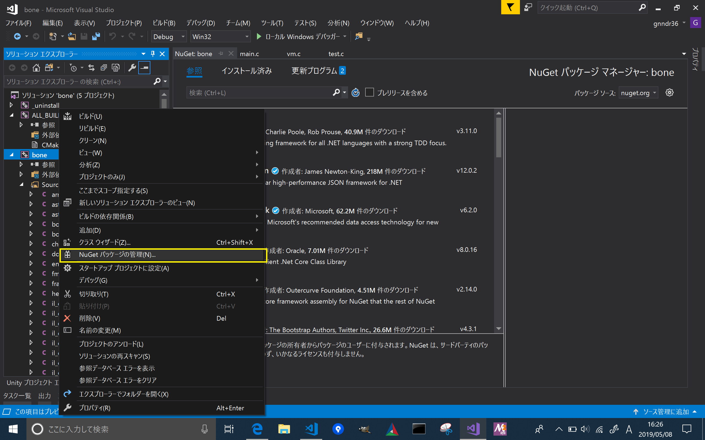
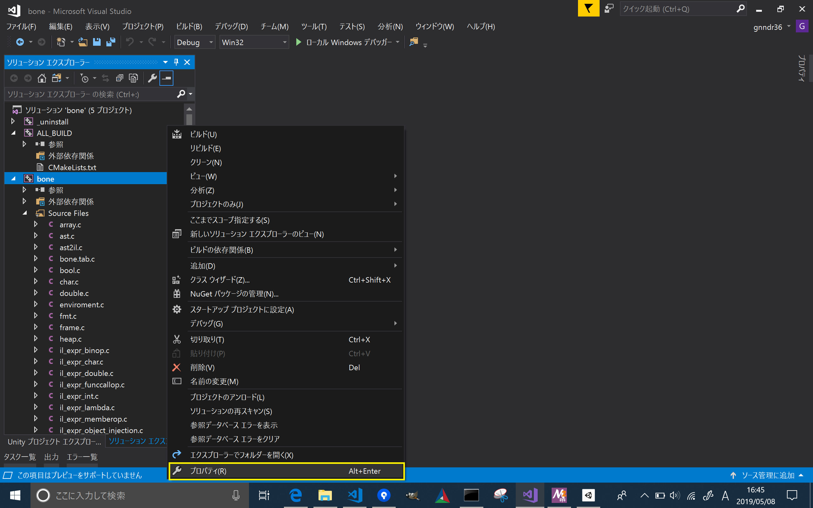
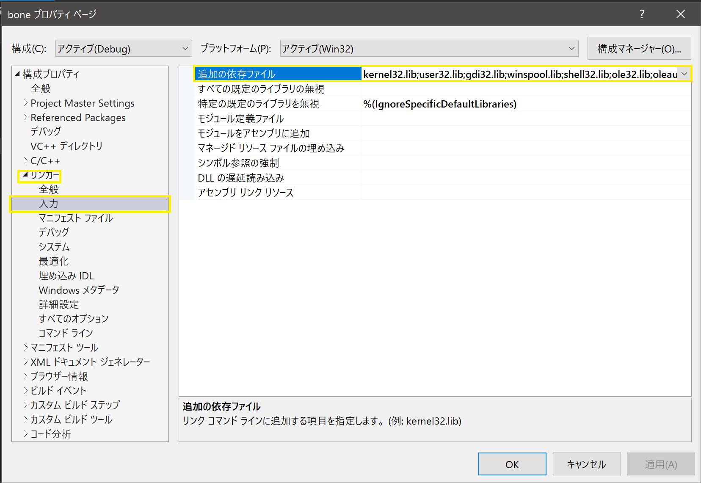
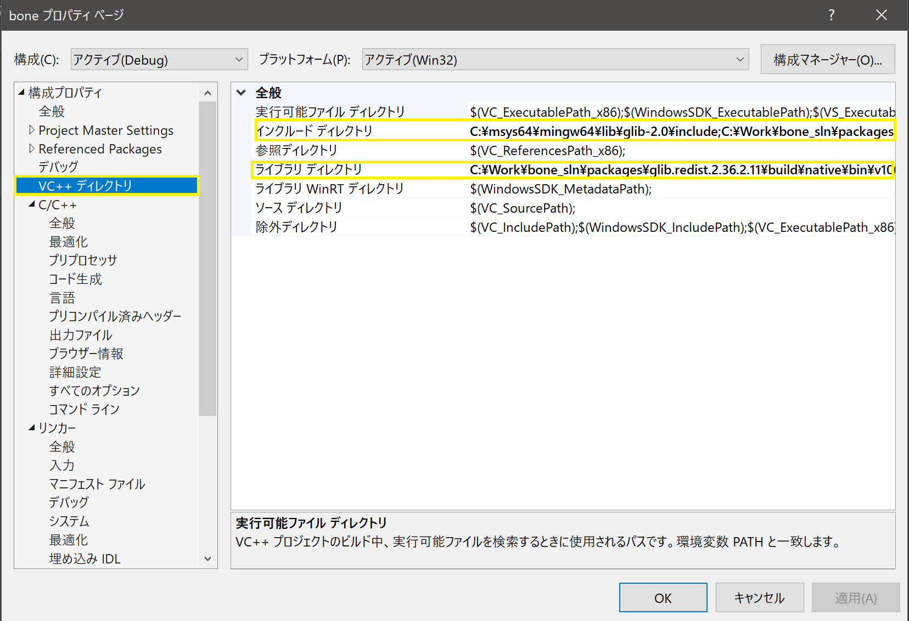
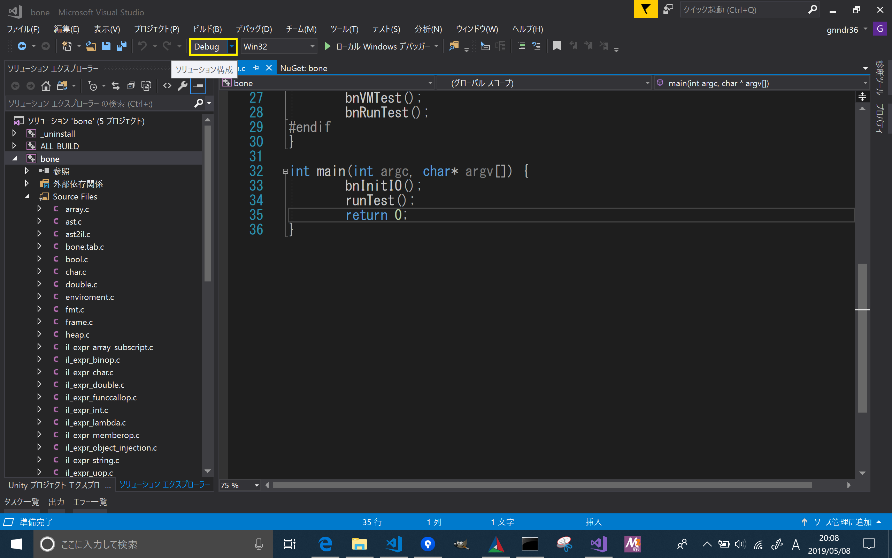
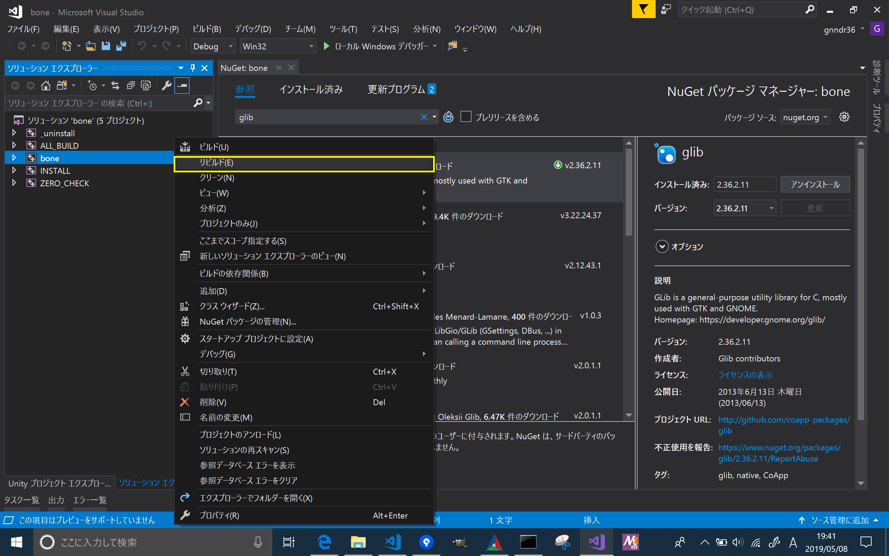

# boneのビルド(build of bone)


## MacOSの場合(when on MacOS)
* まず、homebrewをインストールします。(in first, install homebrew)
    * [homebrew](https://brew.sh/index_ja.html)
* 次に、cmake, glibをインストールします。(in next, install the cmake and glib)
````
brew install glib
brew install cmake
````
* 次にCUnitをインストールします。(in next, install cunit)  
  * [CUnitについての備忘録](https://qiita.com/from_chc/items/db771bef1e83fc00783a)

次のコマンドを打ち込みます。(type next command in terminal)
````
cd bone
cmake .
make
````
## WindowsOSの場合1(when on WindowsOS)
* まず、cmakeをインストールします。(in first, install the cmake)
  * [CMake](https://cmake.org/download/)
* 次に、visualstudioをインストールします。(in ndex, install the visualstudio)
  * [VisualStudio](https://docs.microsoft.com/ja-jp/visualstudio/install/install-visual-studio?view=vs-2019)
* Windows版ビルドではCUnitを使いません(使えません。)
  * CUnitがsnprintfをマクロとして定義しているのをstdio.hが検出してしまうため。
* CMakeを起動して、configure, generateの順に実行します。(launch cmake, execute in order a configure, generate)
  * visualstudioのプロジェクトが作成されます。(is created visual studio project)
  * glibのインクルードパス、ライブラリーパスを設定します。(setup a includePath and libraryPath for use to glib)

* nuget を使う場合
  * ナゲットを使うと簡単です。(use nuget to easy)
  * プロジェクトを右クリックして、ナゲットの管理を選択します。
    
  * インストールを実行します。
    
  * 実行すると packages ディレクトリが作成され、そこにヘッダーとライブラリが格納されます。
  * プロパティを開きます。
    
  * リンカー/追加の依存ファイルからライブラリを追加します。
    
    * gio-2.0.lib
    * glib-2.0.lib
    * gmodule-2.0.lib
    * gobject-2.0.lib
    * gthread-2.0.lib
  * 次に、インクルードパス、ライブラリパスを設定します。
    
    * インクルードパス
      * $(SolutionDir)packages/glib.2.36.2.11/build/native/include 
      * glibconfig.h を含む任意のパス
        * [これ](https://gist.github.com/tversteeg/ba848fad54a96754b64a316ca91b4968)を使うか、msys2からglibをビルドすることで glibconfig.h を作成します。
    * ライブラリパス
      * $(SolutionDir)packages/glib.2.36.2.11/build/native/lib/v110/Win32/Debug:Release/dynamic
      * Debug:ReleaseはVisualStudioの設定と合わせてください。
    
  * ここまでの時点で、プロジェクトを右クリックして**リビルド**を選択すればビルドはできるはずです。
  
  * しかし、デバッグを実行すると XXX.dll が見つからないため、コードの実行を...　といったメッセージが表示されます。
  * これを解決するためには実行時ディレクトリにglibと関連する .dll が必要です。
    * 実行時ディレクトリはデフォルトでソリューション直下です。
    * XXXredist/build/native/bin/v110/Win32/Debug:Release/dynamic 以下の .dll を持ってくればOKです。
    * 具体的には次のファイルです。
      * gio-2-vs10.dll
      * glib-2-vs10.dll
      * gmodule-2-vs10.dll
      * gobject-2-vs10.dll
      * gthread-2-vs10.dll
      * libintl.dll
  * ここまででデバッグが実行できるようになりました。
  * ただし、テストを実行するためにいくつかのファイルが実行時ディレクトリに必要です。
  * 現状では bone/bin/testdata だけ持っていけばOKです。

## WindowsOSの場合2(when on WindowsOS)
* まず、cmakeをインストールします。(in first, install the cmake)
  * [CMake](https://cmake.org/download/)
* 次に、visualstudioをインストールします。(in ndex, install the visualstudio)
  * [VisualStudio](https://docs.microsoft.com/ja-jp/visualstudio/install/install-visual-studio?view=vs-2019)
* コマンドプロンプトから次を実行します。
````
cmake -S your_clone_dir\src -B your_solution_dir -D BONE_RUN=1
````
* 作成されたプロジェクト(your_solution_dir\bone.sln)を開き  
  メニューより　ツール -> Nugetパッケージマネージャ -> パッケージマネージャコンソール　を開く
````
Install-Package glib -ProjectName bone
````
* PowerShellから次を実行します。
````
cd your_solution_dir
mkdir include
Invoke-WebRequest -Uri https://gist.githubusercontent.com/tversteeg/ba848fad54a96754b64a316ca91b4968/raw/5b4e66b7561e092ebcfe4f3fcef478550b5e4ecc/glibconfig.h -OutFile include/glibconfig.h
````
* rubyが実行できるなら、次のスクリプトを実行して  
  bone.vcxprojの一部の設定を置換する
* ruby
  * https://rubyinstaller.org/downloads/
````
lines = []
release = false

a_include = "$(SolutionDir)packages\\glib.2.36.2.11\\build\\native\\include;$(SolutionDir)include;$(IncludePath)"
a_library = "C:\\Users\\Koya\\Documents\\bone_sln\\packages\\glib.2.36.2.11\\build\\native\\lib\\v110\\Win32\\Debug\\dynamic;%(AdditionalLibraryDirectories)"
a_depend = "gio-2.0.lib;glib-2.0.lib;gmodule-2.0.lib;gobject-2.0.lib;gthread-2.0.lib;kernel32.lib;user32.lib;gdi32.lib;winspool.lib;shell32.lib;ole32.lib;oleaut32.lib;uuid.lib;comdlg32.lib;advapi32.lib"

if(release)
  a_include.gsub("Debug", "Release")
  a_include.gsub("debug", "release")
  a_library.gsub("Debug", "Release")
  a_library.gsub("debug", "release")
  a_depend.gsub("Debug", "Release")
  a_depend.gsub("debug", "release")
end
File.open("bone.vcxproj", "r") do |fp|
    txt = fp.read()
    txt.lines do |line|
        tr = line.lstrip
        head = line[0, line.length - tr.length]
        if tr.start_with?("<AdditionalIncludeDirectories>")
            lines << sprintf("%s<AdditionalIncludeDirectories>%s</AdditionalIncludeDirectories>", head, a_include)
        elsif tr.start_with?("<AdditionalLibraryDirectories>")
            lines << sprintf("%s<AdditionalLibraryDirectories>%s</AdditionalLibraryDirectories>", head, a_library)
        elsif tr.start_with?("<AdditionalDependencies>")
            lines << sprintf("%s<AdditionalDependencies>%s</AdditionalDependencies>", head, a_depend)
        else
            lines << line
        end
    end
end
File.open("bone.vcxproj", "w") do |fp|
    lines.each do |line|
        fp.puts(line)
    end
end
````